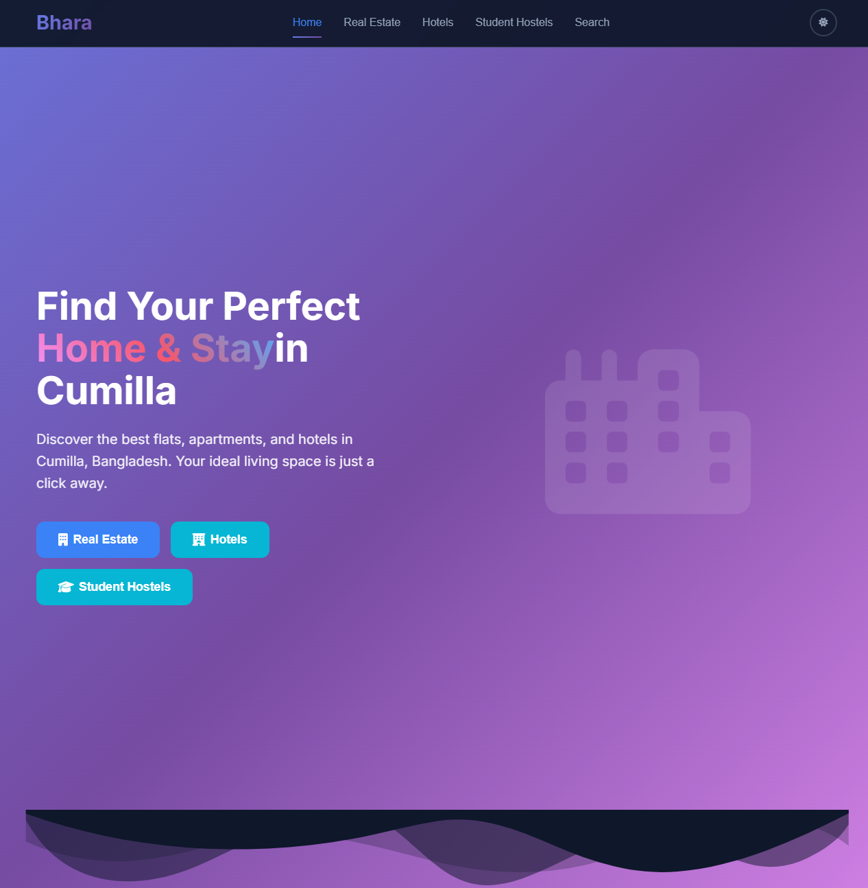
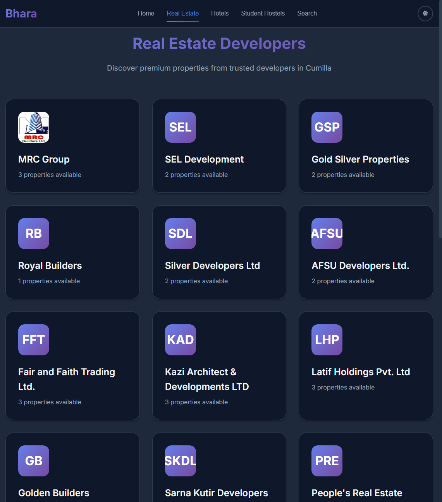

# Bhara - Property Finder React App


A modern React application for finding flats, hotels, and student hostels.

## Features

- **Real Estate Listings**: Browse properties from trusted developers
- **Hotel Bookings**: Find comfortable accommodations
- **Student Hostels**: Affordable housing for students
- **Advanced Search & Filtering**: Filter by type, price, and location
- **Authentication System**: Multiple login options (Google, Phone OTP, Email)
- **Responsive Design**: Works on all devices
- **Dark Mode**: Toggle between light and dark themes
- **Interactive Modals**: Detailed property information
- **Schedule Visits**: Book property visits and virtual tours

## Getting Started

### Prerequisites

- Node.js (version 14 or higher)
- npm or yarn

### Installation

1. Clone the repository:
```bash
git clone <repository-url>
cd Bhara_Startup
```

2. Install dependencies:
```bash
npm install
```

3. Start the development server:
```bash
npm start
```

4. Open [http://localhost:3000](http://localhost:3000) to view it in the browser.

## Available Scripts

- `npm start` - Runs the app in development mode
- `npm test` - Launches the test runner
- `npm run build` - Builds the app for production
- `npm run eject` - Ejects from Create React App (one-way operation)

## Project Structure

```
src/
├── components/          # React components
│   ├── Common/         # Reusable components
│   ├── Footer/         # Footer component
│   ├── Hero/           # Hero section
│   ├── Hotels/         # Hotel-related components
│   ├── Modals/         # Modal components
│   ├── Navbar/         # Navigation bar
│   ├── RealEstate/     # Real estate components
│   ├── Search/         # Search functionality
│   └── StudentHostels/ # Student hostel components
├── context/            # React Context for state management
├── data/              # Sample data
├── utils/             # Utility functions
├── App.js             # Main App component
├── App.css            # Global styles
└── index.js           # Entry point
```

## Technologies Used

- **React 18** - Frontend framework
- **React Context** - State management
- **CSS3** - Styling with CSS variables for theming
- **Font Awesome** - Icons
- **Google Fonts** - Typography

## Features in Detail

### Authentication
- Google OAuth integration (simulated)
- Phone number with OTP verification (simulated)
- Email/password authentication (simulated)

### Property Management
- Real estate developer listings
- Hotel and accommodation search
- Student hostel finder
- Advanced filtering and search

### User Experience
- Responsive design for mobile and desktop
- Dark/light mode toggle
- Smooth animations and transitions
- Intuitive navigation

## Contributing

1. Fork the repository
2. Create your feature branch (`git checkout -b feature/AmazingFeature`)
3. Commit your changes (`git commit -m 'Add some AmazingFeature'`)
4. Push to the branch (`git push origin feature/AmazingFeature`)
5. Open a Pull Request

## License

This project is licensed under the MIT License.

## Contact

For any questions or support, please contact:
- Email: info@bhara.com
- Phone: +880-XXX-XXXXXX
- Location: Cumilla, Bangladesh